# Liri-Node-App
### Liri searches Spotify for songs, Bands in Town for concerts, and OMDB for movies
#
## How to Use
|To search for/get:                                                   |Enter:                                                        |
|---------------------------------------------------------------------|--------------------------------------------------------------|
|Concerts:                                                            |node liri.js concert-this "artist name"                       |
|Songs:                                                               |node liri.js spotify-this-song "song name"                    |
|Movies:                                                              |node liri.js movie-this "movie title"                         |
|A random option:                                                     |node liri.js do-what-it-says                                  |
|Instructions in the console, enter only                              |node liri.js                                                  |
|Any of the results as an html file instead of a console.log use      |node liri.js html-this (and then any other command you wish)  |
To get a predefined result enter only the first command, with no name/title to search for
No quotes are needed, but you are free to use them if you so wish
#
## Technologies Used
-DotEnv
-Axios
-Moment
#
## What Each Command Does
#
### node liri.js concert-this "artist name"
Searches Bands In Town API ("https://rest.bandsintown.com/artists/" + userSearch + "/events?app_id=codingbootcamp") and returns (for 10 shows):
-Venue Name
-Venue Location
-Date of the Show
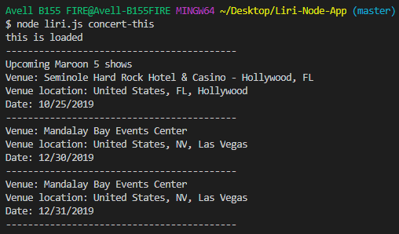
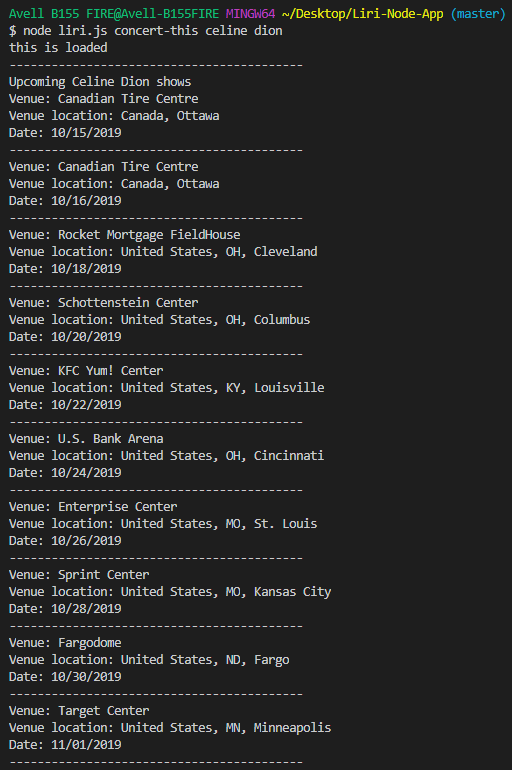
#
### node liri.js spotify-this-song "song name"
Searches Spotify API for the named song and returns:
-Artist/Band Name
-Song Name
-Preview Link from Spotify
-Album Name
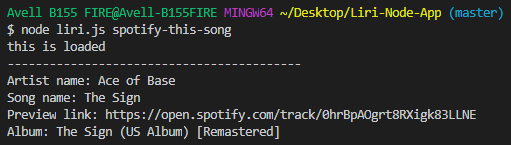
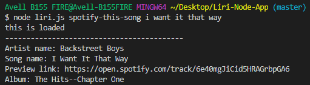
#
### node liri.js movie-this "movie title" 
Searches OMDB API ("http://www.omdbapi.com/?t=" + userSearch + "&apikey=trilogy") for the requested movie and returns:
-Title
-Year of Release
-IMDB Rating
-Rotten Tomatoes Rating
-Country
-Language
-Plot
-Actors
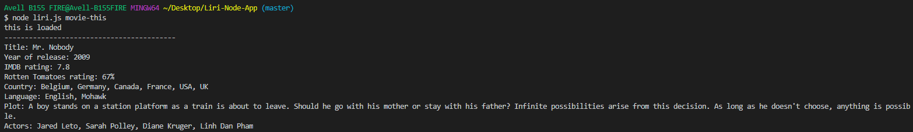
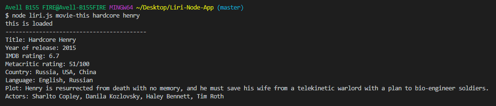
#
### node liri.js do-what-it-says
Picks at random a search parameter with a predefined value from a random.txt file and runs the Switch and subsequent function with it
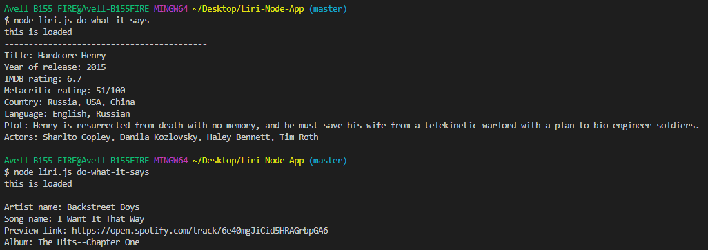
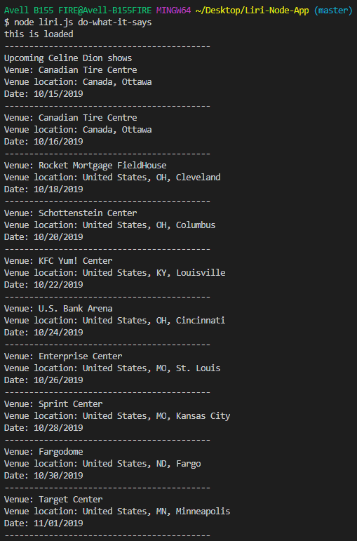
#
### node liri.js
Prints basic instructions on the console
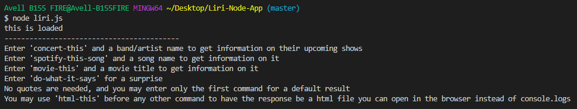
#
### node liri.js html-this
Creates a functional index.html file and replaces all instances of console.log() from the default code with 
 tags on it. Just in case
you don't like the console. Be warned, that file is overwritten every time. If you care about your search history and results, look up the
log.txt file.
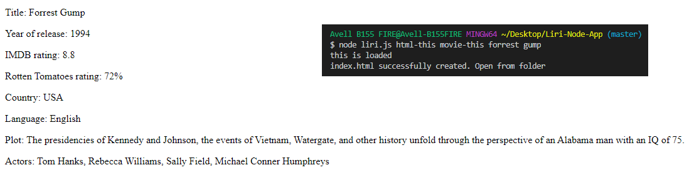
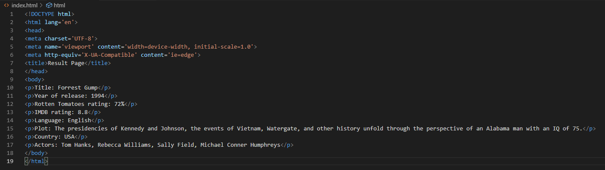